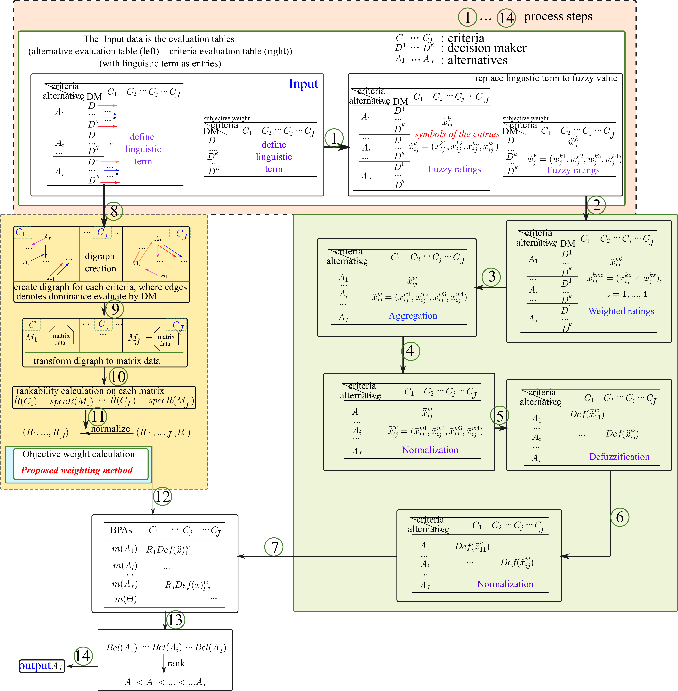

# Rankability-MCDM

This is the official repository for the paper [A rankability-based fuzzy decision making procedure for oil supplier selection](https://www.sciencedirect.com/science/article/pii/S1568494623009742)

### Abstract: 
Multiple-criteria decision-making (MCDM) explicitly assesses several conflicting criteria for our daily lives in selecting products, vehicles, techniques, etc. Weighting on criteria is a critical step in MCDM as the invalid weight of criteria will lead to a wrong decision. The proposed method addresses some drawbacks of the entropy-based weighting method commonly used in MCDM. The proposed new weighting method considers multiple evaluation factors, including the performance of the decision-maker, the edge weight basis of a digraph, and dominance relationships in the data. By incorporating these factors, the proposed method overcomes the limitations of the entropy-based method and reduces the total computation required. We conducted experiments using sustainable transportation data and comprehensively analyzed the results. We also propose a fuzzy MCDM model incorporating the proposed weighting method and Dempster–Shafer’s theory. Our model aims to handle uncertainty and imprecision in decision-making. Finally, the correctness and effectiveness of the proposed model were tested on real-life applications. The results of these tests demonstrated that the proposed method provides a practical and effective approach to decision-making in various domains. Overall, the work introduces a new weighting method based on rankability in MCDM, addresses the limitations of the entropy-based method, and presents a fuzzy MCDM model for handling uncertainty. The experimental results suggest that the proposed approach is promising and offers valuable insights for decision-makers.


## source code and data

we will upload the code and the data soon,

## Citation
If you find our work relevant to your research, please cite:
```
@article{snavsel2023rankability,
  title={A rankability-based fuzzy decision making procedure for oil supplier selection},
  author={Sn{\'a}{\v{s}}el, V{\'a}clav and Perfilieva, Irina and Singh, Meenu and Pant, Millie and Alijani, Zahra and Kong, Lingping},
  journal={Applied Soft Computing},
  pages={110956},
  year={2023},
  publisher={Elsevier}
}
```

## contact
please contact if you find problem or have questions

lingping_kong@yahoo.com

